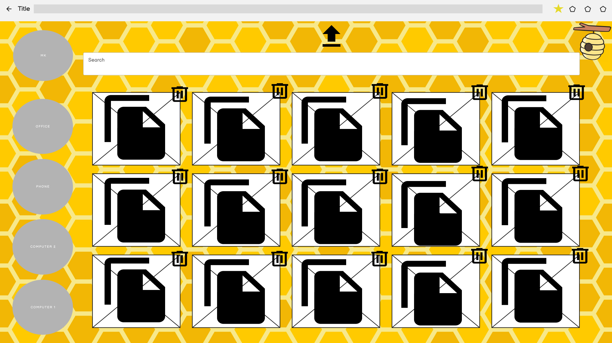

# Prototype

This is the starting point emulating a broswer, the star indicates the extention in your browser tab

When pushed a login screen will pop up

Then a confirmation

And replaced with a clipboard indicating text that a user want to save

Users can paste into the clipboard with shortcut keys or the button on the top right

When a user pasted their results they can push the page lifted button to save it

Users can also click on the bee icon to go into the portion of the app for file passing

When pushing the upload file button users can direct to a directory in the local device and select which files to uploaded

Users can also delete uploaded files and from the same page go to thier profile with the button next to the search function.

From here users can start the recovery process of lost files

To recover simply find the files accedently deleted pushed the recovery file. This page also has additional information to narrow down the correct files

