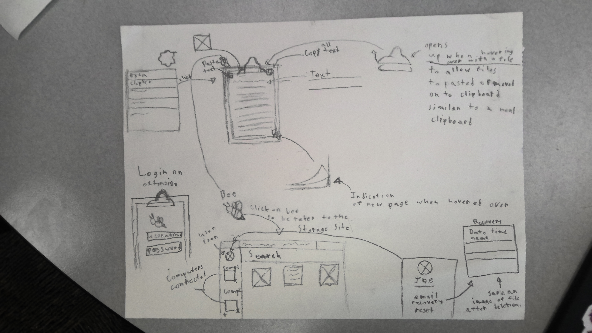

# Sketches

This shows the clipbee extension from login to pasting images and text, there's a site that stores the saved images and clipboards. There's also a profile page with a picture, name, email, recovery, and reset. Recovery is where users can recover an image after deletion if a certain day isn't met.
