# Wireframes

The wireframes start off at frame 1, where the user clicks on the extenstion icon, a stare for a placeholder. While there is text in the doc.
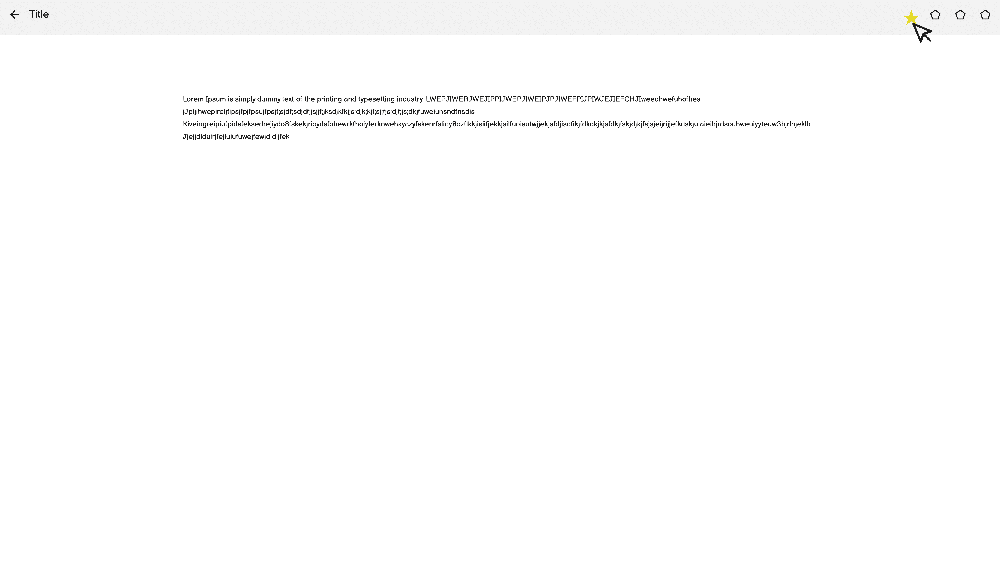

In frame 2 the user has the extension open up and prompts them to login into their account.
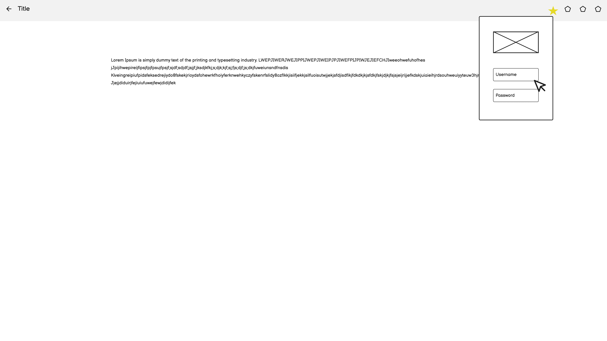

In frame 3 the user has logged out and is given the option to logout instead of continuing to the extension.
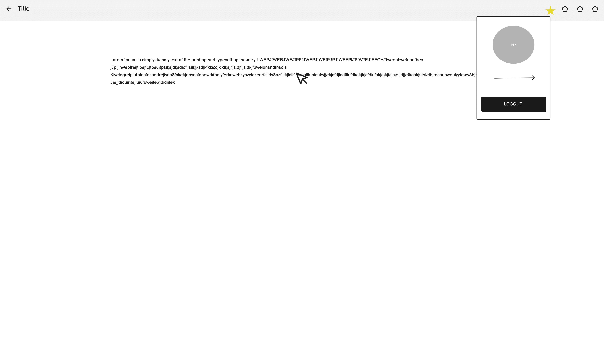

The user is highligthing and copying text from the doc.
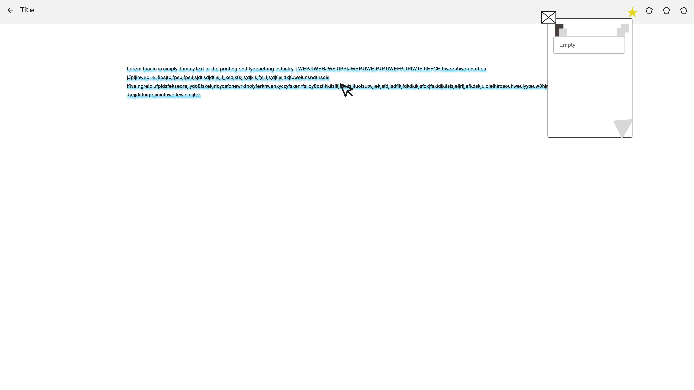

The user pastes the text into the textbox of clipbee.
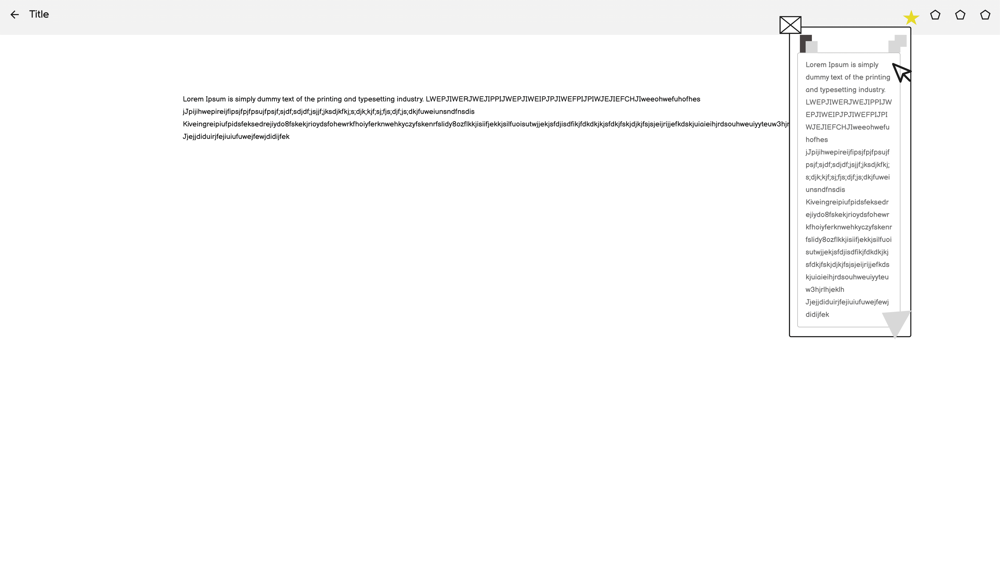

The user then goes down the window of the clipbee to the page flap and clicks it.
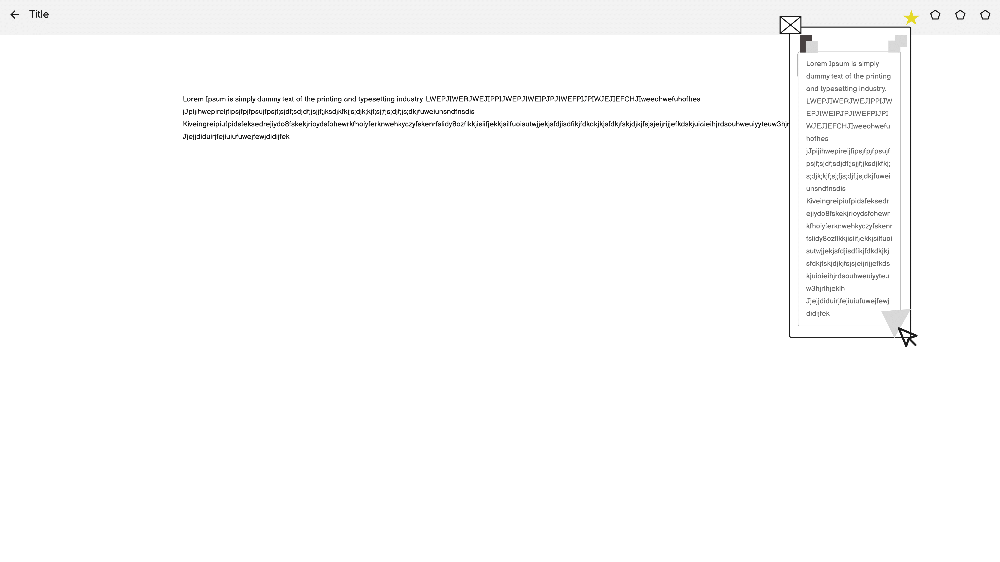

An animation plays of the page turning on the clipbee extension.
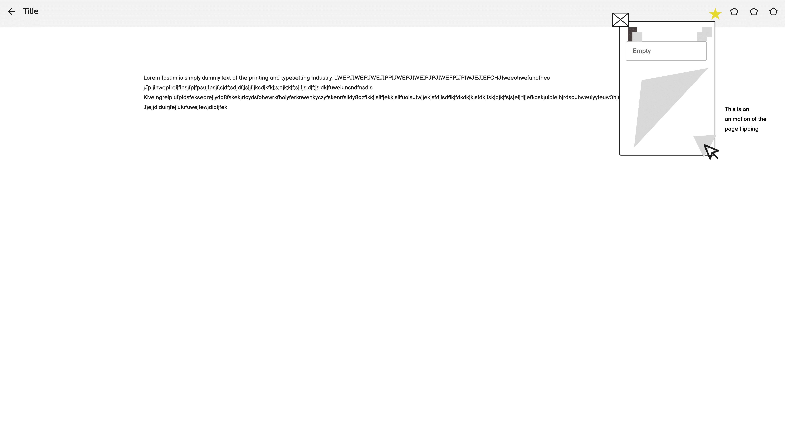

The user is clicking on image that is above the clipbee extension which the image itself is a placeholder for a bee.
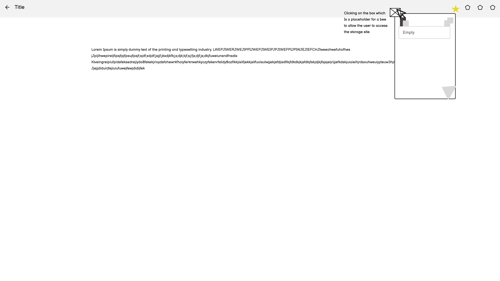

The user it taken to the clipbee storage website which shows icons of which computers are connected to his account with his profile on top of the list and what he has saved onto the clipbee extension. 
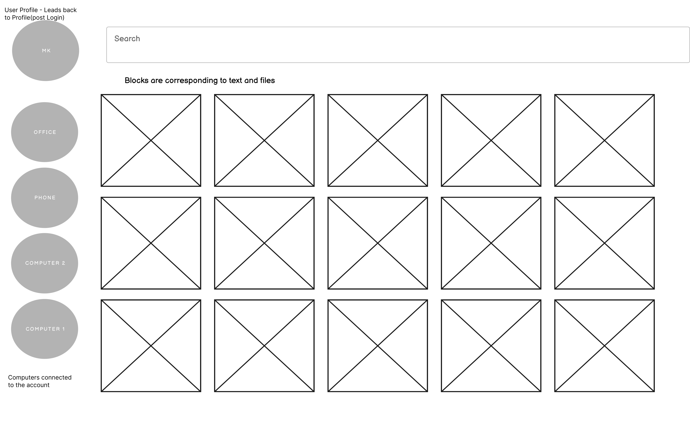

This frame shows the user profile page with buttons to either go to the recovery page, reset the account and check the email, with a bottom button to logout.
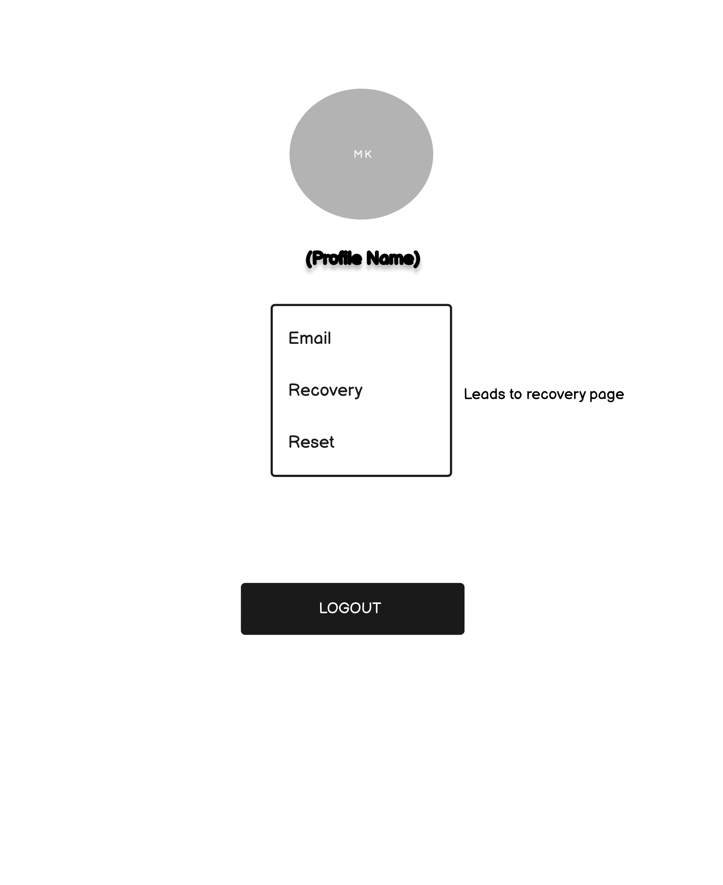

The recovery page showing a list of date and times of what was deleted.
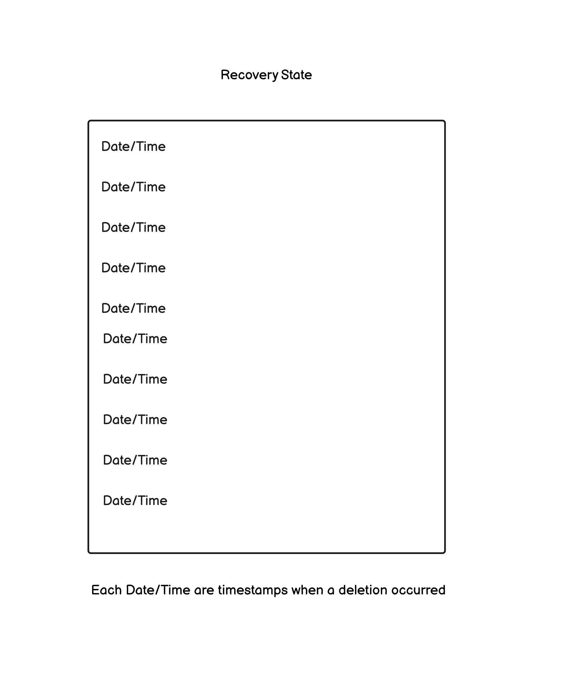
